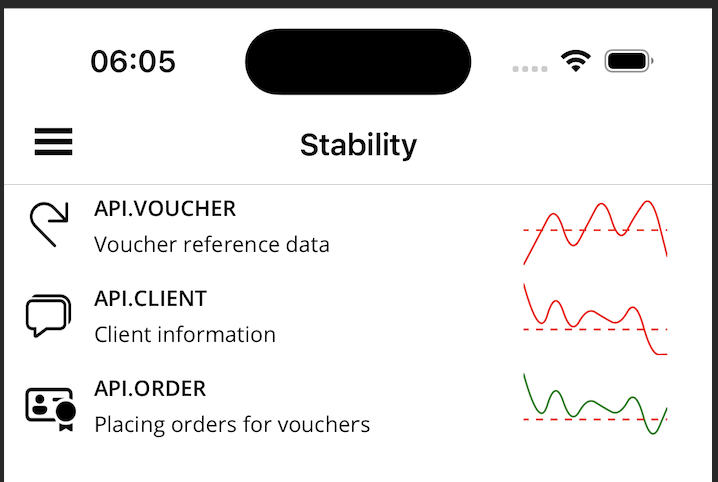

# Plugin.Maui.Sparkline

A simple and lightweight Sparkline chart control for .NET MAUI. Easily visualize trends and data series in a compact, inline format. Ideal for dashboards, reports, and data-driven UIs.

## Features

- Minimalist sparkline chart for quick data visualization
- Easy integration with `CollectionView` or similar controls
- Customizable appearance (colors, thickness, etc.)
- Supports binding to observable collections
- Lightweight and fast



## Installation
(pending - use the code for now)

Add the NuGet package to your .NET MAUI project:

```sh
dotnet add package Plugin.Maui.Sparkline
```

Or via Visual Studio NuGet Package Manager.

## Usage

### 1. Add Namespace

In your XAML file, add the namespace:

```xml
xmlns:sparkline="clr-namespace:Plugin.Maui.Sparkline;assembly=Plugin.Maui.Sparkline"
```

### 2. Add SparklineView to Your Page

```xml
<sparkline:SparklineView 
    WidthRequest="80"
    Grid.Column="2"
    Grid.RowSpan="2"
    HeightRequest="40"
    Values="{Binding Sparkies }"
    LineColor="{Binding LineColor}"
    HorizontalOptions="Start"
    Threshold="{Binding Threshold}"
    ThresholdLineColor="Red"/>
```

### 3. Bind Data

In your ViewModel, expose a collection of numeric values:

```csharp
public ObservableCollection<double> DataPoints { get; } = new ObservableCollection<double> { 1, 3, 2, 5, 4 };
```

### 4. Example in CollectionView

```xml
<CollectionView ItemsSource="{Binding Sparklines}">
    <CollectionView.ItemTemplate>
        <DataTemplate x:DataType="models:SparklineItem">
                <Grid RowDefinitions="20,20" ColumnDefinitions="50, *, 100" Margin="0,5,5,5">
                    <Image Grid.Row="0" Grid.RowSpan="2" Aspect="AspectFit" HorizontalOptions="Fill" WidthRequest="30" HeightRequest="35" VerticalOptions="Start">
                        <Image.Source>
                            <FontImageSource Glyph="{Binding Image}" FontFamily="FluentUI" Color="{AppThemeBinding Light={StaticResource Black}, Dark={StaticResource White}}"/>
                        </Image.Source>
                    </Image>
                    <Label Grid.Row="0" Grid.Column="1" Text="{Binding Name}" FontSize="12" HorizontalOptions="Start" FontAttributes="Bold" FontFamily="OpenSansSemibold"/>
                    <Label Grid.Row="1" Grid.Column="1" Text="{Binding Description}" FontSize="12" HorizontalOptions="Start" LineBreakMode="TailTruncation"/>
                    <sparkline:SparklineView 
                        WidthRequest="80"
                        Grid.Column="2"
                        Grid.RowSpan="2"
                        HeightRequest="40"
                        Values="{Binding Sparkies }"
                        LineColor="{Binding LineColor}"
                        HorizontalOptions="Start"
                        Threshold="{Binding Threshold}"
                        ThresholdLineColor="Red"/>
                </Grid>
        </DataTemplate>
    </CollectionView.ItemTemplate>
</CollectionView>

```

## Properties

| Property            | Type                | Description                                 |
|---------------------|---------------------|---------------------------------------------|
| `Values`            | IEnumerable<double> | The data points to plot                     |
| `LineColor`         | Color               | The color of the sparkline line             |
| `ThresholdLineColor`| Color               | The color of the threshold line             |
| `Threshold`         | Double              | (Optional) The value that should be used to draw the theshold   |


## Sample

See the [samples/MainPage.xaml](samples/MainPage.xaml) for a working example.

## License

This project is licensed under the [MIT License](LICENSE).

## Contributing

Contributions are welcome! Please open issues or submit pull requests.

---

**Plugin.Maui.Sparkline** - Simple, beautiful sparklines for .NET MAUI.